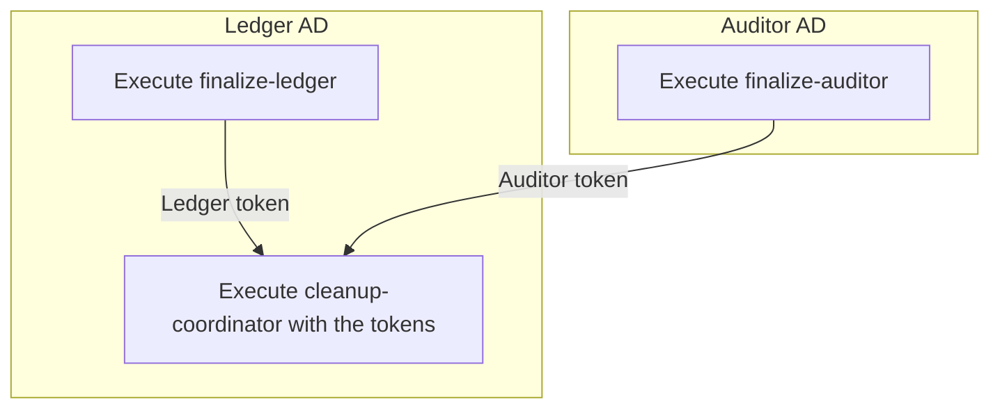

# ScalarDL Cleanup

## What is ScalarDL Cleanup?

ScalarDL Cleanup removes the residual transaction state that a ScalarDL deployment accumulated while
it was running a version of ScalarDL that does not support purge, which is a version earlier than
ScalarDL 3.14.0. The residual transaction state consists of the following:

- **Coordinator state records:** The transaction state records that ScalarDB manages in the
  Coordinator table on the Ledger side.
- **Request proofs:** The records that Auditor stores for each client request to detect Byzantine
  faults.

Because ScalarDL does not purge this state by default, it accumulates over time and consumes
storage. ScalarDL 3.14.0 and later can purge it, but none of the purge options remove the state that
an earlier version wrote, because that state lacks the information that purge requires. Use this
tool to remove that state, once, after you upgrade an existing deployment and before you enable
purge on it. For details about the residual transaction state and the purge options, see
[Purge the Residual Transaction State](https://scalardl.scalar-labs.com/docs/latest/purge-residual-transaction-state/).

The tool is packaged as the container image `ghcr.io/scalar-labs/scalardl-cleanup` and runs as
one-shot Kubernetes `Job`s in the cluster that already runs Ledger and Auditor. You can run it while
Ledger and Auditor are serving traffic. Even so, running it during a window with no traffic or little
traffic is recommended, because the commands then finish sooner.

## How it works

The tool provides three commands, split across the two administrative domains (ADs):

| Command | AD | Description |
|-----------------------|---------|--------------------------------------------------------------------------------------------------------------------------|
| `finalize-ledger`     | Ledger  | Drives every unfinished record in every transactional table to a terminal state, then prints a **completion token**.    |
| `finalize-auditor`    | Auditor | Releases every unreleased asset lock, deletes the request proofs that are safe to remove, then prints a **completion token**. |
| `cleanup-coordinator` | Ledger  | Deletes the Coordinator state records that are safe to remove. Requires **both** completion tokens.                     |

You run the commands in three steps:

1. **In the Ledger AD**, the Ledger operator runs `finalize-ledger` and keeps the Ledger token that
   it prints.
2. **In the Auditor AD**, the Auditor operator runs `finalize-auditor`, then hands the Auditor token
   that it prints to the Ledger operator out of band.
3. **In the Ledger AD**, once both tokens are in hand, the Ledger operator runs
   `cleanup-coordinator` with both of them.



## Limitations

- The tool supports **Azure Cosmos DB for NoSQL** only. The tool rejects other configurations including `multi-storage`.
- Ledger must not share the Coordinator table that its ScalarDB manages with any other ScalarDB
  instance.
- [`tx_state_management.enabled`](https://scalardl.scalar-labs.com/docs/latest/configurations/#tx_state_managementenabled)
  has never been enabled.
- [`coordinator.group_commit.enabled`](https://scalardb.scalar-labs.com/docs/latest/configurations/#coordinatorgroup_commitenabled)
  has never been enabled.

## Manifest files

The manifests are in `manifests/`, split into one directory per administrative domain — each
operator applies only their own domain's directory:

**`ledger-ad/`** (Ledger AD)

| File | Kind | Description |
|----------------------------|-----------------------|---------------------------------------------------------------------|
| `pvc.yaml`                 | PersistentVolumeClaim | Checkpoint volume, shared by both Ledger commands                  |
| `configmap.yaml`           | ConfigMap             | Config for the `finalize-ledger` and `cleanup-coordinator` commands |
| `finalize-ledger.yaml`     | Job                   | Runs `finalize-ledger`                                              |
| `cleanup-coordinator.yaml` | Job                   | Runs `cleanup-coordinator`                                          |

**`auditor-ad/`** (Auditor AD)

| File | Kind | Description |
|-------------------------|-----------------------|-------------------------------------------|
| `pvc.yaml`              | PersistentVolumeClaim | Checkpoint volume |
| `configmap.yaml`        | ConfigMap             | Config for the `finalize-auditor` command |
| `finalize-auditor.yaml` | Job                   | Runs `finalize-auditor`                   |

## What you can configure

Configuration falls into two groups: **deploy-time variables** you set in your shell, and
the **settings each command reads** from its `.properties` file (supplied via the ConfigMap or the Secret).

### 1. Deploy-time variables

| Variable | Used in | Description |
|----------------------------------|------------------------------------------|----------------------------------------------------------------------|
| `CLEANUP_VERSION`                | the Job manifests                        | Image tag, `ghcr.io/scalar-labs/scalardl-cleanup:<CLEANUP_VERSION>` |
| `LEDGER_TOKEN` / `AUDITOR_TOKEN` | `ledger-ad/cleanup-coordinator.yaml` | The two completion tokens                                            |

### 2. Settings the commands accept

Each command reads these properties from the `.properties` file that its AD's ConfigMap supplies.
`scalar.db.storage` is preset to `cosmos`. Each property name links to its entry in the ScalarDB or
ScalarDL configuration reference, except the `scalar.dl.tools.*` properties, which belong to this
tool.

**Ledger AD** — `ledger-ad/configmap.yaml`, read by `finalize-ledger` and `cleanup-coordinator`:

| Property | Description |
|---|---|
| [`scalar.db.contact_points`](https://scalardb.scalar-labs.com/docs/latest/configurations/#storage-related-configurations) | Required. The Cosmos DB account URI. |
| [`scalar.db.password`](https://scalardb.scalar-labs.com/docs/latest/configurations/#storage-related-configurations) | Required. The Cosmos DB key, supplied from the AD's Secret as `${env:SCALAR_DB_PASSWORD}`. |
| [`scalar.db.consensus_commit.coordinator.namespace`](https://scalardb.scalar-labs.com/docs/latest/configurations/#coordinatornamespace) | Optional. Set it only if Ledger overrides the default `coordinator` namespace. |
| `scalar.dl.tools.scan.cosmos.max_threads` | Optional. The scan parallelism. Defaults to `32`. |
| `scalar.dl.tools.scan.cosmos.page_size` | Optional. The records fetched per query page. Defaults to `100`. |

**Auditor AD** — `auditor-ad/configmap.yaml`, read by `finalize-auditor`:

| Property | Description |
|---|---|
| [`scalar.db.contact_points`](https://scalardb.scalar-labs.com/docs/latest/configurations/#storage-related-configurations) | Required. The Cosmos DB account URI. |
| [`scalar.db.password`](https://scalardb.scalar-labs.com/docs/latest/configurations/#storage-related-configurations) | Required. The Cosmos DB key, supplied from the AD's Secret as `${env:SCALAR_DB_PASSWORD}`. |
| [`scalar.dl.client.auditor.host`](https://scalardl.scalar-labs.com/docs/latest/configurations/#auditorhost) | Required. |
| [`scalar.dl.auditor.namespace`](https://scalardl.scalar-labs.com/docs/latest/configurations/#namespace-1) | Optional. Defaults to `auditor`. |
| [`scalar.dl.client.auditor.port`](https://scalardl.scalar-labs.com/docs/latest/configurations/#auditorport) | Optional. Defaults to `40051`. |
| [`scalar.dl.client.auditor.privileged_port`](https://scalardl.scalar-labs.com/docs/latest/configurations/#auditorprivileged_port) | Optional. Defaults to `40052`. |
| [`scalar.dl.client.auditor.tls.enabled`](https://scalardl.scalar-labs.com/docs/latest/configurations/#auditortlsenabled) | Optional. |
| [`scalar.dl.client.auditor.tls.ca_root_cert_path`](https://scalardl.scalar-labs.com/docs/latest/configurations/#auditortlsca_root_cert_path) | Optional. |
| [`scalar.dl.client.auditor.tls.ca_root_cert_pem`](https://scalardl.scalar-labs.com/docs/latest/configurations/#auditortlsca_root_cert_pem) | Optional. An inline PEM, used in place of `ca_root_cert_path`. |
| [`scalar.dl.client.auditor.tls.override_authority`](https://scalardl.scalar-labs.com/docs/latest/configurations/#auditortlsoverride_authority) | Optional. |
| [`scalar.dl.client.auditor.authorization.credential`](https://scalardl.scalar-labs.com/docs/latest/configurations/#auditorauthorizationcredential) | Optional. |
| `scalar.dl.tools.scan.cosmos.max_threads` | Optional. The scan parallelism. Defaults to `32`. |
| `scalar.dl.tools.scan.cosmos.page_size` | Optional. The records fetched per query page. Defaults to `100`. |

## Getting started

Run the steps in order, from the `manifests/` directory (the file paths below are relative to it).
**Steps 1 and 2 are independent** (either operator can go first, or in parallel); **step 3 needs
both tokens.** Each step exports the variables it needs at the top; `CLEANUP_VERSION` is the image
tag (`ghcr.io/scalar-labs/scalardl-cleanup:<CLEANUP_VERSION>`).

### Prerequisites

- A Kubernetes worker node has room for the **2 vCPU and 4 GiB of memory** that each Job requests
  (`requests` equal `limits`).
- `kubectl` and `envsubst` (from `gettext`) are installed on your machine.

### Step 1 — Ledger AD: `finalize-ledger`

Set the variables this step uses:

```bash
export LEDGER_NS=<ledger-namespace> CLEANUP_VERSION=<image-tag>
```

**a. Credentials.** Create the Secret holding the Cosmos DB key:

```bash
kubectl -n "${LEDGER_NS:?}" create secret generic scalardl-cleanup-credentials \
  --from-literal=SCALAR_DB_PASSWORD='<cosmos-primary-key>'
```

**b. Checkpoint volume.**

```bash
kubectl -n "${LEDGER_NS:?}" apply -f ledger-ad/pvc.yaml
```

**c. Config.** Set `scalar.db.contact_points` in `ledger-ad/configmap.yaml`, then apply it:

```bash
kubectl -n "${LEDGER_NS:?}" apply -f ledger-ad/configmap.yaml
```

**d. Run.** Apply the Job:

```bash
: "${CLEANUP_VERSION:?}" && envsubst < ledger-ad/finalize-ledger.yaml | kubectl -n "${LEDGER_NS:?}" apply -f -
```

Wait for the Job to complete, then read the completion token from the log of its succeeded Pod. The
command prints its result as one JSON line:

```json
{"status_code":"OK","output":{"completion_token":"<base64url-encoded token>"}}
```

Keep the token in `completion_token` — it is the **Ledger token**.

If the command fails, it prints an error message in place of that result, and the Job retries it up
to three times (`backoffLimit: 3` in the manifest), starting a new Pod each time. If none of those
attempts succeeds, the Job fails. Deploying the Job again without deleting the checkpoint volume
resumes the processing from the same checkpoint data. To start the processing over from the beginning
instead, see [Re-running after a failure](#re-running-after-a-failure).

### Step 2 — Auditor AD: `finalize-auditor`

Set the variables this step uses:

```bash
export AUDITOR_NS=<auditor-namespace> CLEANUP_VERSION=<image-tag>
```

**a. Credentials.** Create the Secret holding the Cosmos DB key:

```bash
kubectl -n "${AUDITOR_NS:?}" create secret generic scalardl-cleanup-credentials \
  --from-literal=SCALAR_DB_PASSWORD='<cosmos-primary-key>'
```

**b. Checkpoint volume.**

```bash
kubectl -n "${AUDITOR_NS:?}" apply -f auditor-ad/pvc.yaml
```

**c. Config.** Set `scalar.db.contact_points` and `scalar.dl.client.auditor.host` in
`auditor-ad/configmap.yaml` (for TLS, also uncomment the TLS properties listed in the optional note
below), then apply it:

```bash
kubectl -n "${AUDITOR_NS:?}" apply -f auditor-ad/configmap.yaml
```

**Optional — TLS to Auditor.** If TLS is enabled on Auditor, do this *before* step (d).

In `auditor-ad/configmap.yaml` (step c), uncomment:

- `scalar.dl.client.auditor.tls.enabled=true`
- `scalar.dl.client.auditor.tls.ca_root_cert_path=/cert/scalardl-cleanup/tls.crt`
- `scalar.dl.client.auditor.tls.override_authority=<auditor-cert-cn-or-san>` — set the value; only if it differs from the host you connect to

Then create the cert Secret holding the CA root cert that signed the Auditor server cert.

```bash
kubectl -n "${AUDITOR_NS:?}" create secret generic scalardl-cleanup-cert --from-file=tls.crt=<ca.pem>
```

**Optional — Auditor authorization credential.** If Auditor requires an authorization credential, do this *before* step (d).

In `auditor-ad/configmap.yaml` (step c), uncomment:

- `scalar.dl.client.auditor.authorization.credential=${env:SCALAR_DL_CLIENT_AUDITOR_AUTHORIZATION_CREDENTIAL}`

Then add the credential to the Secret created in step (a):

```bash
kubectl -n "${AUDITOR_NS:?}" patch secret scalardl-cleanup-credentials --type merge \
  -p '{"stringData":{"SCALAR_DL_CLIENT_AUDITOR_AUTHORIZATION_CREDENTIAL":"<credential>"}}'
```

**d. Run.** Apply the Job:

```bash
: "${CLEANUP_VERSION:?}" && envsubst < auditor-ad/finalize-auditor.yaml | kubectl -n "${AUDITOR_NS:?}" apply -f -
```

Wait for the Job to complete, then read the completion token from the log of its succeeded Pod. The
command prints its result as one JSON line, in the same shape as the one that `finalize-ledger`
prints in step 1.

Hand the token in `completion_token` — the **Auditor token** — to the Ledger operator.

If the command fails, it prints an error message in place of that result, and the Job retries it up to
three times (`backoffLimit: 3` in the manifest), starting a new Pod each time. If none of those
attempts succeeds, the Job fails. Deploying the Job again without deleting the checkpoint volume
resumes the processing from the same checkpoint data. To start the processing over from the beginning
instead, see [Re-running after a failure](#re-running-after-a-failure).

### Step 3 — Ledger AD: `cleanup-coordinator`

Run this once you have **both** tokens; it reuses the checkpoint volume, ConfigMap, and Secret from
step 1. Set the variables, including both tokens:

```bash
export LEDGER_NS=<ledger-namespace> CLEANUP_VERSION=<image-tag>
export LEDGER_TOKEN=<ledger-token> AUDITOR_TOKEN=<auditor-token>
```

Apply the Job, then wait for it to complete:

```bash
: "${CLEANUP_VERSION:?}" "${LEDGER_TOKEN:?}" "${AUDITOR_TOKEN:?}" && envsubst < ledger-ad/cleanup-coordinator.yaml | kubectl -n "${LEDGER_NS:?}" apply -f -
```

Confirm that the command reported `OK` in the log of its succeeded Pod. This command emits no
completion token, so `output` is `null`:

```json
{"status_code":"OK","output":null}
```

If the command fails, it prints an error message in place of that result, and the Job retries it up to
three times (`backoffLimit: 3` in the manifest), starting a new Pod each time. If none of those
attempts succeeds, the Job fails. Deploying the Job again without deleting the checkpoint volume
resumes the deletion from the same checkpoint data. To start the processing over from the beginning
instead, see [Re-running after a failure](#re-running-after-a-failure).

## Re-running after a failure

Each Job records progress on its checkpoint volume, which is a separate object and is kept when the
Job is deleted. Deleting and re-applying a failed Job therefore **resumes where it stopped**.
Re-export the same variables the original step used, then delete and re-apply the failed command's
Job:

**`finalize-ledger` (Ledger AD)**

```bash
kubectl -n "${LEDGER_NS:?}" delete job/scalardl-finalize-ledger
: "${CLEANUP_VERSION:?}" && envsubst < ledger-ad/finalize-ledger.yaml | kubectl -n "${LEDGER_NS:?}" apply -f -
```

**`finalize-auditor` (Auditor AD)**

```bash
kubectl -n "${AUDITOR_NS:?}" delete job/scalardl-finalize-auditor
: "${CLEANUP_VERSION:?}" && envsubst < auditor-ad/finalize-auditor.yaml | kubectl -n "${AUDITOR_NS:?}" apply -f -
```

**`cleanup-coordinator` (Ledger AD)**

```bash
kubectl -n "${LEDGER_NS:?}" delete job/scalardl-cleanup-coordinator
: "${CLEANUP_VERSION:?}" "${LEDGER_TOKEN:?}" "${AUDITOR_TOKEN:?}" && envsubst < ledger-ad/cleanup-coordinator.yaml | kubectl -n "${LEDGER_NS:?}" apply -f -
```

On a resumed `cleanup-coordinator`, the token values are ignored — the deletion boundary saved in the
checkpoint is authoritative.

### Starting over from scratch

To discard the saved progress and start fresh, delete the Job **and** its checkpoint volume,
re-create the volume, then re-apply the Job (the matching block above). The Ledger checkpoint volume
is shared by both Ledger commands, so resetting it affects `finalize-ledger` and `cleanup-coordinator`
together.

**Ledger AD**

```bash
kubectl -n "${LEDGER_NS:?}" delete job/scalardl-finalize-ledger   # and/or job/scalardl-cleanup-coordinator
kubectl -n "${LEDGER_NS:?}" delete pvc/scalardl-cleanup-checkpoint
kubectl -n "${LEDGER_NS:?}" apply -f ledger-ad/pvc.yaml
```

**Auditor AD**

```bash
kubectl -n "${AUDITOR_NS:?}" delete job/scalardl-finalize-auditor
kubectl -n "${AUDITOR_NS:?}" delete pvc/scalardl-cleanup-checkpoint
kubectl -n "${AUDITOR_NS:?}" apply -f auditor-ad/pvc.yaml
```

## Cleaning up the deployed objects

After all three commands have succeeded, remove the objects you created. Do not remove them while
any command still has work left: deleting the checkpoint volume discards the progress that a resumed
run would continue from.

**Ledger AD**

```bash
kubectl -n "${LEDGER_NS:?}" delete job/scalardl-finalize-ledger job/scalardl-cleanup-coordinator
kubectl -n "${LEDGER_NS:?}" delete configmap/scalardl-cleanup-ledger-config
kubectl -n "${LEDGER_NS:?}" delete secret/scalardl-cleanup-credentials
kubectl -n "${LEDGER_NS:?}" delete pvc/scalardl-cleanup-checkpoint
```

**Auditor AD**

```bash
kubectl -n "${AUDITOR_NS:?}" delete job/scalardl-finalize-auditor
kubectl -n "${AUDITOR_NS:?}" delete configmap/scalardl-cleanup-auditor-config
kubectl -n "${AUDITOR_NS:?}" delete secret/scalardl-cleanup-credentials
kubectl -n "${AUDITOR_NS:?}" delete secret/scalardl-cleanup-cert --ignore-not-found  # only if you enabled TLS
kubectl -n "${AUDITOR_NS:?}" delete pvc/scalardl-cleanup-checkpoint
```
